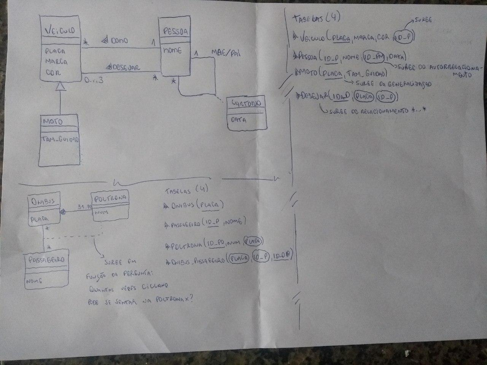

# Projeto de Banco de Dados

## Referencias:

* Sistema de Banco de Dados do Navathe
* https://www.youtube.com/watch?v=pmAxIs5U1KI&list=PLxI8Can9yAHeHQr2McJ01e-ANyh3K0Lfq

## Currículo de aulas

### 24 de agosto

* Dependencia funcional

### 31 de Agosto

* Introdução à normalização de dados

***

## Dependência Funcional

É a restrição de projeto de banco de dados, que define que: para cada atributo, ou conjunto de atributos, de uma relação, um outro atributo, ou conjunto de atributos, depende sua existência. Pegamos como exemplo o seguinte esquema:

| id | cpf | nome | nascimento |
|----|-----|------|------------|

> Uma dependência sempre será estabelecida por um projetista, não podemos afirmar, dada uma instância de um esquema, que há uma depedência funcional entre determinados atributos.

Voltemos. Propõem-se que, no esquema acima, o projetista definiu que o atributo `id` é a chave primária e o atributo CPF é `chave candidata`. Podemos inferir, a partir disso, que:

`id -> {cpf, nome, nascimento}`

e

`cpf -> {id, nome, nascimento}`

Leia-se: cpf leva a id, nome e nascimento, ou, id leva a cpf, nome e nascimento.

Para ficar ainda mais claro: se eu tenho um instância desse meu esquema, com os seguintes dados:

| id | cpf       | nome     | nascimento |
|----|-----------|----------|------------|
| 1  | 123456789 | Fulano   | 2000-01-01 |
| 2  | 123987654 | Ciclano  | 2000-01-01 |
| 3  | 123456798 | Beltrano | 2000-02-01 |

Toda vez que eu tiver, id 1, eu terei:

* CPF 123456789
* nome Fulano
* nascimento 2000-01-01

Pois estes atributos dependem funcionalmente de id. Da mesma forma é a chave candidata CPF, pois como a mesma não se repete, eu posso inferir que, ao ter o CPF 123456798, eu terei:

* id 3
* nome Beltrano
* nascimento 2000-02-01

Para mais detalhes acerca desse assunto, confira o [texto do IME](https://www.ime.usp.br/~andrers/aulas/bd2005-1/aula11.html)

Outro link interessante: [DevMedia](https://www.google.com.br/amp/www.techtudo.com.br/dicas-e-tutoriais/noticia/2014/04/como-saber-qual-e-a-placa-de-video-do-notebook.amp)

## Normalização

É um conjunto de regras, baseado em formas normais (1FN, 2FN, 3FN e Boyce Codd, etc) com o objetivo de reduzir as redundâncias e as anomalias (inclusão, alteração e exclusão) de uma tabela.

### 1° FN

Não pode existir domínios compostos e atributos multivalorados, ou seja, somente atributos atômicos (indivisíveis). A seguir, os campos (**lê-se domínios**), endereço e e-mail não atendem a tal forma.

| Matr | Nome  | End                                   | email                       |
|------|-------|---------------------------------------|-----------------------------|
|   1  | Rui   | Rua A, 5 - Penha - Nilópolis/RJ       |                             |
|   2  | Maria | Rua B, 10 - Test - Duque de Caxias/RJ | ana@test.com anao@teste.com |
|   3  | João  | Rua C, 9 - Mackenzie - São Paulo/SP   |                             | 

### 2° FN

Não pode haver dependência funcional parcial de chave primária, ou seja, um ou mais atributos que dependam de um atributo que faz parte da chave. Para se estar nessa forma, todos os atributos normais do registro, dependem de uma chave primária total

### 3° FN

Não deve haver dependência transitiva (funcional). Ou seja, um ou mais atributos  que dependam de outros atributos que não façam parte da chave

### Boyce Codd

## Mapeamento OO -> Modelo Conceitual

### Conceitual vs Lógico vs Físico

* **Conceitual**: trata dos conceitos, e mais próximo do usuário. É alto nível.
* **Lógico**: trata da lógica dos esquemas relacionais. Uma implementação do diagrama de classes, com chaves primárias e estrangeiras e os campos das tabelas
* **Físico**: é a implementação do modelo lógico. Há restrições naquele campo? Qual o tamanho máximo para um campo nome?

Alguns exemplos de notação:

```
- * = 0..*
- 1 = 1..1 (2 = 2..2, ...)
- 0..1 = 0..1 (é necessário mapear a cardinalidade corretamente)
```

### Quando um relacionamento vira uma tabela?

* Muitos para muitos -> cria-se uma tabela "auxiliar"
* Muitos para um -> não
* Um para muitos -> não
* Um para Um -> não (em casos especiais, cria-se uma tabela auxiliar)

A seguir, dois exemplos de mapeamentos OO para Relacional:



### Mapeamento do Modelo ER para o Banco de Dados

* Toda Entidade vira uma tabela
* Todo relacionamento n para n, vira uma tabela

### Projeto Lógico

Se preocupa com o esquema relacional, criação de tabelas e relacionamentos, bem como seus atributos. Aqui que se preocupa em criar uma implementação física dos nossos diagramas. Se preocupa com a linguagem técnica, porém generalizada.

### Índices

> É uma estrutura auxiliar para recuperar os dados de forma eficiente. Estrutura secundária (à parte da tabela), armazenada em memória secundária. Armazena uma série de ponteiros para os endereços em memória da tabela.

#### Tipos de Índices

* **Índice primário**: são ordenados e não denso
* **Índice secundário**: além do acesso primário, fornece o acesso secundário. Isto é, uma ocorrência no arquivo de índice, para cada ocorrência no arquivo de dados, e é denso
