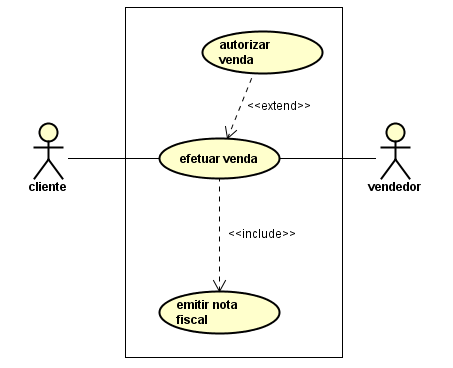
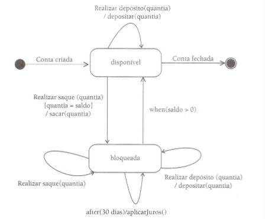

# Analise e Projeto Orientados a Objeto

O objetivo dessa disciplina é prover ao aluno conhecimento e ferramenta para a Análise de Projetos Orientados a Objeto.

## Processo de desenvolvimento de software

Como tudo na vida, desenvolver software é um processo que possui etapas. Sendo usadas ou não, é necessário organizar os processos para softwares possam ser entregues com qualidade. A seguir, os processos para o desenvolvimento de software:

+ **Análise**: consiste em levantar os requisitos do sistema proposto com o objetivo de entender o seu funcionamento.
+ **Projeto**: considera os aspectos lógicos e independentes de implementação. Nesta fase, determina-se como o sistema funcionará. Como artefatos, são produzidos diagramas de casos de uso, diagramas de classes entre outros.
+ **Implementação**: é a fase de codificação utilizando linguagem de programação.
+ **Testes**: nesta etapa são realizados testes para verificação / detecção de erros.
+ **Implantação**: o sistema é impacotado, distribuído e instalado no ambiente do usuário.

## Requisitos

É uma condição ou uma necessidade que o sistema se propõe a realizar. Podem ser de dois tipos:

### Funcionais

Definem as funcionalidades a serem desenvolvidas do sistema. Exemplo:

> O sistema deve permitir lançar nota pelo professor.

### Não-funcionais

Declaram as características de qualidade que o sistema deve possuir e que estão relacionadas às suas funcionalidades. Exemplo:

> Confiabilidade, desempenho, segurança...

## Os diagramas UML

A UML, sigla para Unified Modeling Language ou Linguagem de Modelagem Unificada, é um conjunto de diagramas que tem por objetivo documentar de forma visual um software. Ela é usada na etapa de analise e projeto no desenvolvimento de software.

Foi criada na década de 1990 por [James Rumbaugh](https://pt.wikipedia.org/wiki/James_Rumbaugh), [Grady Booch](https://pt.wikipedia.org/wiki/Grady_Booch) e [Ivar Jacobson](https://en.wikipedia.org/wiki/Ivar_Jacobson), com o intuito de unir diferentes modelos de diagramação orientados a objetos na época.

Atualmente a UML está na sua segunda versão, com 13 diagramas dividos em 3 categorias:

+ **Diagramas de estrutura**: inclui os diagramas de Classes, Objetos, Componentes, de Deploy, Pacotes e de Composição de estrutura.

+ **Diagramas de comportamento**: inclui os diagramas de Casos de Uso, Atividade e Máquina de estados.

+ **Diagramas de interação**: inclui os diagramas de Interação, Sequencia, Comunição e Tempo.

Aqui será abordado os Diagramas de Casos de Uso, Classes, Sequencia e de Máquinas de Estado.

---

## Diagrama de Casos de Uso

> Um caso de uso representa quem faz o que (interage) com o sistema, sem considerar o comportamento interno do sistema

Em suma, o diagrama de Casos de Uso ilustra os requisitos funcionais do sistema, sem levar em conta como isso será implementado no mesmo.

#### Notação

+ **Elipse**: representa o caso de uso, ou seja, as funções/funcionalidades do sistema.
+ **Fronteira**: retangulo que demarca o espaço do sistema em relação ao espaço não participante do sistema.
+ **Ator**: pesssoa/outro sistema que interage com o sistema.
+ **Setas/Linhas**: representam os relacionamentos entre atores/funcionalidades
  + Ator primário: é o que dispara o caso de uso. Que interaje diretamente com o caso de uso.
  + Ator secundário: é que auxilia o ator primário na execução do caso de uso. Não interaje diretamente com o caso de uso.

#### Estereótipos que ocorrem entre casos de uso:

##### Include

Representa um relacionamento obrigatório. Exemplo: ao executar o caso de uso `efetuar venda`, obrigatoriamente será executado o caso de uso `emitir nota fiscal`.

##### Extend

Representa um relacionamento não obrigatório. Exemplo: para ser executado o caso de uso `efetuar venda`, não é obrigatório executar o caso de uso `autorizar venda`.

Exemplo:

#### Estereotipo que ocorre tanto entre casos de uso quanto entre atores

##### Generalização

Este relacionamento permite que um caso de uso (ator) herde caracteristicas de outro caso de uso (ator). O caso de uso (ator) herdeiro é responsavel por implementar por si mesmo o comportamento herdado. O caso de uso (ator) herdado é conhecido como caso de uso (ator) base.

---

## Diagrama de Classes

> Um Diagrama de Classes é um diagrama do tipo estático que define quais as entidades em seus sistema bem como o relacionamento entre elas.

O diagrama de classes fornece as seguintes visualizações:

+ **Conceitual**, pois fornece os principais conceitos do sistema, bem como os domínios do mesmo.
+ **Especificação**, pois oferece a possibilidade de compreender os métodos do sistema, sem fornecer como os mesmos irão ser implementados.
+ **Implementação**, pois fornece os principais detalhes de implementação do sistema, como visibilidade e tipos de atributos das classes.

#### Principais conceitos:

##### Classes

São as abstrações das entidades. Podemos fazer paralelo com as entidades de um Modelo Entidade-Relacionamento(EE). Toda classe contem **atributos**, que são as suas caracteristicas e pode conter **métodos / ações**, que define os comportamentos da mesma.

##### Relacionamentos / associações

São as associações entre as classes. Novamente, é possível fazer paralelo com o Modelo EE. Cada classe, quando em um relacionamento, desempenha um **papel**. Também ocorre no relacionamento o que se chama de **multiplicidade**, que é representar quantas instancias de uma classe podem se relacionamento com quantas instancias de uma outra classe.

Tipos de relacionamento:

###### Generalização

É o ato de generalizar uma classe em outra classe. O processo oposto é de **especialização**. Neste relacionamento, há o conceito de herança, em que a classe que herda (especializa) outra, herda suas caracteristicas. Há alguns nomes diferentes para o que ocorre aqui, mas em suma são a mesma coisa. Exemplo: *subclasse* (a que herda) e *superclasse* (a que faz herdar).

Há o conceito de **classe abstrata** que surge. A classe abstrata, na UML, é representada como uma classe que contem o nome em itálico.

###### Classe associativa

É uma classe que nasce de uma associação entre duas ou mais classes. Essa classe surge da necessidade de guardar informações que surgem da associação. Podemos exemplificar com a seguinte situação: temos a classe Pessoa que se relaciona com a classe Empresa. No relacionamento entre os dois surge a classe Emprego, sendo que esta só existe quando ocorre o relacionamento, temos portanto uma classe associativa:

###### Agregação

É quando ocorre uma associação entre classes, em que uma é parte e outra é o todo. Exemplo: classe JOGADOR que se relaciona com o CLUBE que se relaciona com ASSOCIAÇÃO.

###### Composição

É quando ocorre uma associação entre classes, em que a classe TODO é responsável pelas suas partes de tal forma que se a classe TODO deixa de existir, as suas partes também.

###### Associações reflexivas

É quando a classe se associase a ela mesma. Conhecido no Modelo EE como Auto Relacionamento.

---

## Diagrama de estados

> É o diagrama que representa as mudanças de estado de um objeto no sistema

### Conceitos apresentados no livro Princípios da UML, do Bezerra

#### Estado

Um estado é uma situação na vida de um objeto durante a qual ele satisfaz algu­ma condição ou realiza alguma atividade. Um estado tem a ver com o valor de um atributo do objeto, como por exemplo, dizer-se que uma conta bancária está vermelha.

#### Transições

Os estados estão associados a outros pelas transições. Uma transição é mostrada como uma linha conectando estados, com uma seta apontando para um dos es­tados. Quando ocorre uma transição entre estados, diz-se que a transição foi dis­parada.

#### Evento

Uma transição possui um evento associado. Um evento é algo que acontece em algum ponto no tempo e que pode modificar o estado de um objeto.

#### Condição de guarda

É uma expressao que retorna um valor lógico. Ela é acionada quando o objeto vai mudar de estado. Se retornar positivo, ocorre a mudança, do contrário, não ocorre.

#### Ações

Ao passar de um estado para um outro, o objeto pode executar uma ou mais ações.

#### Estados aninhados

Ocorre quando um estado possui outros estados dentro de si. Também é conhecido como *estado composto*.

Exemplo básico

Exemplo um pouco mais complexo

## Diagrama de sequencia

> O objetivo deste diagrama é explicitar a interação entre objetos numa ordem temporal em que elas acontecem.

Elementos:

### Linha de vida

Uma linha de vida mostra o tempo a qual o objeto tem sua "vida" no sistema.

Exemplos de linha de vida:

### Mensagem

Uma mensagem é quando um objeto envia uma ação a outro. Neste diagrama, uma mensagem é referenciada como uma seta entre uma linha de vida e outra

Exemplos de formatos de mensagens

Exemplo de diagrama de sequencia

É importante entender o fluxo no diagrama acima, num padrão MVC:

> O ator que interage dispara o fluxo. Ele interage com o controlador ou a view. Se for a view, está emite uma mensagem para o controlador para que este converse com a classe de negócio, que contém o método necessário a ação.

Exemplo com figuras para o controler e view

---

## Diagrama de pacotes:

> É um agrupamento da UML que define os relacionamentos entre grupos de classes do sistema. Eles são importantes para agrupar as classes do sistema.

Exemplo:

---

## Diagrama de componentes:

> Exemplifica os componentes do sistema, ele é mais voltado a parte de implementação do sistema

Exemplo:

## Referencias:

- [Site oficial da UML](http://www.uml.org/)
- [Wikipedia](https://pt.wikipedia.org/wiki/Wikip%C3%A9dia:P%C3%A1gina_principal)
- Livro Principios da UML do Bezerra
