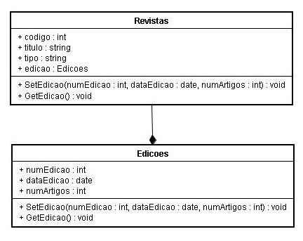

# Analise e Projeto Orientados a Objeto

## Processo de desenvolvimento de software

+ **Análise**: consiste em levantar os requisitos do sistema proposto com o objetivo de entender o seu funcionamento.
+ **Projeto**: considera os aspectos lógicos e independentes de implementação. Nesta fase, determina-se como o sistema funcionará. Como artefatos são produzidos diagramas de casos de uso, diagramas de classes entre outros.
+ **Implementação**: é a fase de codificação utilizando linguagem de programação.
+ **Testes**: nesta etapa são realizados testes para verificação / detecção de erros.
+ **Implantação**: o sistema é impacotado, distribuído e instalado no ambiente do usuário.

## Requisitos

É uma condição ou uma necessidade que o sistema se propõe. Podem ser do tipo:

+ **Requisitos funcionais**: definem as funcionalidades a serem desenvolvidas do sistema. Exemplo:
> O sistema deve permitir lançar nota pelo professor.

+ **Requisitos não-funcionais**: declaram as características de qualidade que o sistema deve possuir e que estão relacionadas às suas funcionalidades. Exemplo:
> Confiabilidade, desempenho, segurança...

## Diagrama de Casos de Uso

> Um caso de uso representa quem faz o que (interage) com o sistema, sem considerar o comportamento interno do sistema

Em suma, o diagrama de Casos de Uso ilustra os requisitos funcionais do sistema, sem levar em conta como isso será implementado no sistema.

#### Conceitos importantes:

+ **Elipse**: representa o caso de uso, ou seja, as funções/funcionalidades do sistema.
+ **Fronteira**: retangulo que demarca o espaço do sistema em relação ao espaço não participante do sistema.
+ **Ator**: pesssoa/sistema que interage com o sistema.
+ **Setas/Linhas**: representam os relacionamentos entre atores/funcionalidades
  + Ator primário: é o que dispara o caso de uso. Que interaje diretamente com o caso de uso.
  + Ator secundário: é que auxilia o ator primário na execução do caso de uso. Não interaje diretamente com o caso de uso.

#### Estereótipos - ocorre entre casos de uso:

+ Include: representa um relacionamento obrigatório. Exemplo: ao executar o caso de uso `efetuar venda`, obrigatoriamente será executado o caso de uso `emitir nota fiscal`.

+ Extend: representa um relacionamento não obrigatório. Exemplo: para ser executado o caso de uso `efetuar venda`, não é obrigatório executar o caso de uso `autorizar venda`.

Exemplo:

## Diagrama de Classes

Um Diagrama de Classes é um diagrama do tipo estático que define quais as entidades em seus sistema bem como o relacionamento entre elas.

Podemos visualizar o diagrama de classes que nos fornece as seguintes perspectivas:

+ **Conceitual**, pois fornece os principais conceitos do sistema, bem como os domínios do mesmo.
+ **Especificação**, pois oferece a possibilidade de compreender os métodos do sistema, sem fornecer como os mesmos irão ser implementados.
+ **Implementação**, pois fornece os principais detalhes de implementação do sistema, como visibilidade e tipos de atributos das classes.

#### Principais conceitos:

+ **Classes**: são as abstrações das entidades. Podemos fazer paralelo com as entidades de um Modelo Entidade-Relacionamento(EE).

+ **Relacionamentos / associações**: são as associações entre as classes. Novamente, é possível fazer paralelo com o Modelo EE.

+ **Papel**: papel desempenhado pela classe quando se relaciona com outra classe.

+ **Generalização**: é o ato de generalizar uma classe em outra classe. O processo oposto é de **especialização**.

+ **Atributos**: características da classe.

+ **Operações / métodos**: são os métodos da classe

+ **Classe associativa**: é uma classe que nasce de uma associação. Exemplo: registrar logs de operações de um determinado usuário no sistema.

+ **Agregação**: É quando ocorre uma associação entre classes, em que uma é parte e outra é o todo. Exemplo: classe JOGADOR que se relaciona com o CLUBE que se relaciona com ASSOCIAÇÃO.

+ **Composição**: é quando ocorre uma associação entre classes, em que a classe TODO é responsável pelas suas partes de tal forma que se a classe TODO deixa de existir, as suas partes também

+ **Associações reflexivas**: É quando a classe se associase a ela mesma. Conhecido no Modelo EE como Auto Relacionamento.

+ **Multiplicidade**: é a famosa 'cardinalidade', que define quantas instancias de uma classe pode se relacionar com tantas instancias de outra classe.

## Diagrama de estados

É o diagrama que representa as mudanças de estado de um objeto no sistema

### Conceitos apresentados no livro Princípios da UML, do Bezerra

+ **Estado**: Um estado é uma situação na vida de um objeto durante a qual ele satisfaz algu­ma condição ou realiza alguma atividade. Um estado tem a ver com o valor de um atributo do objeto, como por exemplo, dizer-se que uma conta bancária está vermelha.

+ **Transições**: Os estados estão associados a outros pelas transições. Uma transição é mostrada como uma linha conectando estados, com uma seta apontando para um dos es­tados. Quando ocorre uma transição entre estados, diz-se que a transição foi dis­parada.

+ **Evento**: Uma transição possui um evento associado. Um evento é algo que acontece em algum ponto no tempo e que pode modificar o estado de um objeto.

+ **Condição de guarda**: é uma expressao que retorna um valor lógico. Ela é acionada quando o objeto vai mudar de estado. Se retornar positivo, ocorre a mudança, do contrário, não ocorre.

+ **Ações**: ao passar de um estado para um outro, o objeto pode executar uma mais ações.

+ **Estados aninhados**: ocorre quando um estado possui outros estados dentro de si. Também é conhecido como *composto*.

Exemplo básico

Exemplo um pouco mais complexo

## Diagrama de sequencia

O objetivo deste diagrama é explicitar a interação entre objetos numa ordem temporal em que elas acontecem.

Elementos:

+ **Linha de vida**: uma linha de vida mostra o tempo a qual o objeto tem sua "vida" no sistema.

Exemplos de linha de vida:

+ **Mensagem**: uma mensagem é quando um objeto envia uma ação a outro. Neste diagrama, uma mensagem é referenciada como uma seta entre uma linha de vida e outra

Exemplos de formatos de mensagens

Exemplo de diagrama de sequencia

